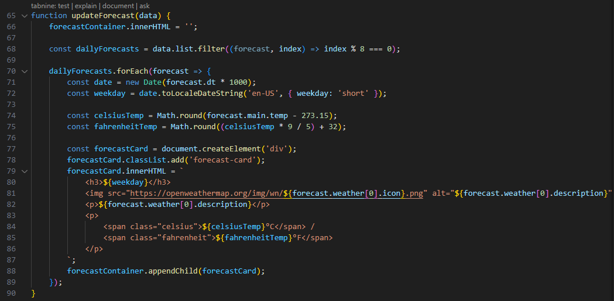

# Rain-Rain-Go-Away 
A 5-day weather forecast dashboard 

## Introduction:
Welcome to Rain-Rain Go Away, a web application that provides current weather and 5-day forecast information for cities worldwide. This application utilizes the OpenWeatherMap API to fetch weather data, displaying it in a user-friendly interface.

You can view the deployed website at https://jacqmcq.github.io/Rain-Rain-Go-Away/

## Features: 
Current Weather Display: Shows current temperatures in Celsius and Fahrenheit; having family in Canada, I find having both readily available, useful for personal use. Also included is the description, humidity, and wind speed for the searched city. Celsius and Fahrenheit are displayed on the card as I have a lot of family living in Canada and wanted to offer this easy conversion on my application. 

5-Day Weather Forecast: Displays weather forecasts for the next 5 days. 

    -(Two calls are made: One for the current weather and another for the 5-day forecast).

Search History: Maintains a history of searched cities, allowing users to quickly revisit previous searches retrieved from local storage.

Responsive Design: Designed to be responsive and work well on different devices and screen sizes

Error Handling: Specified error handling to indicate if error occurred with fetching from the API or user input. 

## Usage:

1. Search for a City:

Enter the name of a city in the input field and submit the form.
If the city is found, the application will display its current weather and 5-day forecast.

2. View Weather Details:

The current weather section shows temperature, weather description, humidity, and wind speed.
The forecast section displays weather forecasts for the next 5 days, including icons representing weather conditions and temperature.

3. Historical Navigation:

Click on any city in the search history list to quickly fetch and display weather information for that city.

## References:

This application utilizes the OpenWeatherMap API to fetch weather data. To fetch the data, an account was established and a unique APIKey was appointed for linking to the server. 
The use of AI technology was used to debug the 404 errors received when attempting to fetch from the API using the city root value. AI was also used to support the use of the input field for the city to assist with eliminating any white space to prevent the submission from throwing an error. API fetch call research retrieved from https://openweathermap.org/forecast5#min. 

Asynch Func:

When reviewing MD3 documentation (https://developer.mozilla.org/en-US/docs/Web/JavaScript/Reference/Statements/async_function) as well as Tabnine extension in VS code, asynch function (promise based) was used to simplify the fetch call function. The await keyword is used to wait for the promise returned by the getWeatherData function to be resolved.This line (catch (error)) starts another try-catch block that catches any errors that occurred in the previous try block.

Date object:

In the selected code, the Date object is used to extract the day of the week for each forecast. It takes the timestamp of the forecast (stored in the dt property of the forecast object) and multiplies it by 1000 to convert it from seconds to milliseconds. Then, it creates a new Date object with this timestamp and uses the toLocaleDateString method to get the day of the week in a short format. This information is then displayed on the webpage alongside the weather forecast for that day.

Icon used on loading page was retrieved from: https://www.istockphoto.com/photos/sunny-weather

